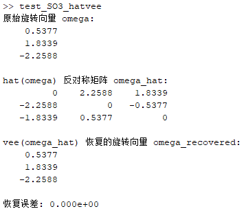
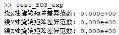
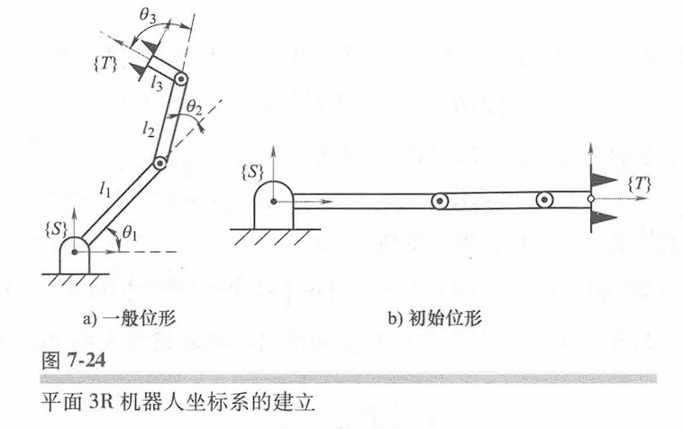

# 基于指数积公式（POE）的串联机器人标定的代码实现

	杂事比较多，很久没更新了，在做并联标定之前先把之前的串联相关的代码理顺吧。正好对之前写的内容做一下验证和修改，大部分公式参考的是该篇论文：

> Ruibo H, Yingjun Z, Shunian Y, Shuzi Y, et al. Kinematic-Parameter Identification for Serial-Robot Calibration Based on POE Formula[J], IEEE transactions on robotics, 2010, 26(3): 411-423.

	我会在代码中表明公式出处，并进行验证。代码均在MATLAB运行，后续需要集成的话会移植到python，但实际上我看到有开源库已经做了这些事了，不过并联的标定还确实没人开源。

# 1.$SO(3)$上的指数、对数映射以及线性映射

	帽（hat）操作：

```matlab
function omega_hat = hat_so3(omega)
% hat_so3 将3x1旋转向量omega转换为3x3反对称矩阵。
% 对应知乎文章：《基于指数积方法的串联机器人标定数学模型》中的式（1）
%
% 输入:
%   omega - 3x1的旋转向量 [omega_x; omega_y; omega_z]
%
% 输出:
%   omega_hat - 3x3的反对称矩阵
%               [ 0        -omega_z   omega_y;
%                 omega_z   0        -omega_x;
%                -omega_y   omega_x   0      ]

    omega_hat = [  0       -omega(3)  omega(2);
                 omega(3)    0      -omega(1);
                -omega(2)  omega(1)    0    ];
end
```

	vee操作：

```matlab
function omega = vee_so3(omega_hat)
% vee_so3 SO(3)的vee操作，将3x3反对称矩阵映射为3x1旋转向量
% 没有对应的公式，只是hat的反操作
% 输入：
%   omega_hat - 3x3反对称矩阵，满足 omega_hat' = -omega_hat
%
% 输出：
%   omega - 3x1旋转向量

    % 验证输入是否为3x3矩阵
    assert(all(size(omega_hat) == [3, 3]), 'Input must be a 3x3 matrix');
    % 验证是否反对称
    assert(norm(omega_hat + omega_hat', 'fro') < 1e-10, 'Input matrix must be skew-symmetric');

    omega = [omega_hat(3,2); omega_hat(1,3); omega_hat(2,1)];
end
```

	验证一下：

```matlab
%% 验证脚本
% 随机生成旋转向量
omega = randn(3,1);

% 计算hat映射
omega_hat = hat_so3(omega);

% 计算vee映射
omega_recovered = vee_so3(omega_hat);

% 显示结果
disp('原始旋转向量 omega:');
disp(omega);
disp('hat(omega) 反对称矩阵 omega_hat:');
disp(omega_hat);
disp('vee(omega_hat) 恢复的旋转向量 omega_recovered:');
disp(omega_recovered);

% 验证误差
error = norm(omega - omega_recovered);
fprintf('恢复误差: %.3e\n', error);
```

	运行结果：

​

	验证无误。

	接下来写$SO(3)$上的指数映射，由论文附录1中的式（44）给出：

$$
R = \mathbf{I}_3 + \frac{\sin(\|\omega\| q)}{\|\omega\|} \hat{\omega} + \frac{1 - \cos(\|\omega\| q)}{\|\omega\|^2} \hat{\omega}^2
$$

```matlab
function R = exp_so3(omega, q)
% exp_so3_axis_angle 计算SO(3)的指数映射，基于旋转轴和角度
% 
% 输入：
%   omega - 3x1旋转轴向量（不要求归一化）
%   q     - 旋转角度或关节变量（标量）
%
% 输出：
%   R - 3x3旋转矩阵

    omega_norm = norm(omega);
    if omega_norm < 1e-12
        R = eye(3);
        return;
    end
    theta = omega_norm * q;
    omega_hat = hat_so3(omega);

    R = eye(3) + (sin(theta)/omega_norm) * omega_hat + ...
        ((1 - cos(theta))/omega_norm^2) * (omega_hat * omega_hat);
end
```

	验证一下：

```matlab
% 验证脚本：使用Robotics System Toolbox的axang2rotm验证自定义指数映射

% 定义绕x,y,z轴的旋转轴（单位向量）
omega_x = [1 0 0];
omega_y = [0 1 0];
omega_z = [0 0 1];

% 定义旋转角度（弧度）
q_x = pi/6; % 30度
q_y = pi/4; % 45度
q_z = pi/3; % 60度

% 机器人系统工具箱轴角格式：[axis_x axis_y axis_z angle]
axang_x = [omega_x, q_x];
axang_y = [omega_y, q_y];
axang_z = [omega_z, q_z];

% 使用Robotics System Toolbox函数生成旋转矩阵
R_x_toolbox = axang2rotm(axang_x);
R_y_toolbox = axang2rotm(axang_y);
R_z_toolbox = axang2rotm(axang_z);

% 使用自定义指数映射函数计算旋转矩阵
R_x_custom = exp_so3(omega_x', q_x);
R_y_custom = exp_so3(omega_y', q_y);
R_z_custom = exp_so3(omega_z', q_z);

% 计算并显示差异范数，越接近0表示越一致
fprintf('绕X轴旋转矩阵差异范数: %.3e\n', norm(R_x_toolbox - R_x_custom));
fprintf('绕Y轴旋转矩阵差异范数: %.3e\n', norm(R_y_toolbox - R_y_custom));
fprintf('绕Z轴旋转矩阵差异范数: %.3e\n', norm(R_z_toolbox - R_z_custom));
```

	运行结果：

​

	验证无误。

	那接下来写一下$SO(3)$上的对数映射，由我之前的文章《[基于指数积方法的串联机器人标定数学模型](https://zhuanlan.zhihu.com/p/1905992094713112362)》（12）给出，同时还补充了theta=0的情况：

$$
\log(\mathbf{R}) = 
\begin{cases}
\frac{\theta}{2\sin(\theta)} \left( \mathbf{R} - \mathbf{R}^T \right), & \text{if } \theta \neq 0 \\
0, & \text{if } \theta = 0
\end{cases}
$$

```matlab
function omega_hat = log_so3(R)
% log_so3 计算SO(3)旋转矩阵的对数映射，返回so(3)的3x3反对称矩阵
% 对应知乎文章：《基于指数积方法的串联机器人标定数学模型》中的式（12），并补充了theta为0的情况
% 输入：
%   R - 3x3旋转矩阵
%
% 输出：
%   omega_hat - 3x3反对称矩阵（so(3)元素）
%
% 公式参考你提供的图片

    theta = acos( min(max((trace(R) - 1)/2, -1), 1) ); % 防止数值误差
    if abs(theta) < 1e-12
        omega_hat = zeros(3,3);
    else
        omega_hat = (theta / (2*sin(theta))) * (R - R');
    end
end
```

	验证一下：

```matlab
% 验证脚本
% 生成随机旋转轴（单位向量）
omega = randn(3,1);
omega = omega / norm(omega);

% 旋转角度
q = pi/4; % 45度

% 计算旋转矩阵
R = exp_so3(omega, q);

% 计算对数映射（反对称矩阵）
omega_hat_rec = log_so3(R);

% 将反对称矩阵映射回旋转向量
omega_rec = vee_so3(omega_hat_rec);

% 原始旋转向量（旋转轴乘以角度）
omega_true = omega * q;

% 显示结果
disp('原始旋转向量 omega_true:');
disp(omega_true);

disp('恢复旋转向量 omega_rec:');
disp(omega_rec);

% 计算误差
error = norm(omega_true - omega_rec);
fprintf('恢复误差: %.3e\n', error);
```

	运行结果：

​

	验证无误。

	至此$SO(3)$中的李群李代数的基本操作也就写完了，接下来写$SE(3)$的。

# 2.$SE(3)$上的指数映射、对数映射以及线性映射

	首先给一下$se(3)$上的元素定义：

$$
\boldsymbol{\hat{\xi}}={\binom{{{\left\lbrack{\omega}\right\rbrack}_{\times}}\boldsymbol{v}}{\boldsymbol{0}\quad0}}
$$

	我们常说的旋量定义为一个列向量：

$$
\xi := [\omega,\, v]^T \in \mathbb{R}^{6\times1}
$$

	帽（hat）操作：

```matlab
	function xi_hat = hat_se3(xi)
% hat_se3 将6x1运动旋量xi转换为4x4李代数矩阵（se(3)元素）
% 对应知乎文章：《基于指数积方法的串联机器人标定数学模型》中的式（14）
% 输入：
%   xi - 6x1运动旋量，格式为 [omega; v]
%        omega - 3x1旋转分量
%        v     - 3x1平移分量
%
% 输出：
%   xi_hat - 4x4李代数矩阵
%

    omega = xi(1:3);
    v = xi(4:6);
    omega_hat = hat_so3(omega);
    xi_hat = [omega_hat, v;
              0, 0, 0, 0];
end
```

	测试一下：

```matlab
% 测试脚本
% 定义旋转分量 omega 和平移分量 v
omega = [0.1; -0.2; 0.3];
v = [1.0; 2.0; 3.0];

% 组合成6x1运动旋量 xi
xi = [omega; v];

% 调用hat_se3函数
xi_hat = hat_se3(xi);

% 手动计算期望的xi_hat
omega_hat = hat_so3(omega);
xi_hat_expected = [omega_hat, v; 0 0 0 0];

% 显示结果
disp('hat_se3计算结果 xi_hat = ');
disp(xi_hat);

disp('期望结果 xi_hat_expected = ');
disp(xi_hat_expected);

% 验证两者是否相等（允许一定数值误差）
tolerance = 1e-12;
if norm(xi_hat - xi_hat_expected, 'fro') < tolerance
    disp('测试通过：hat_se3函数输出正确。');
else
    disp('测试失败：hat_se3函数输出与期望不符。');
end


% --- 需要你已定义的hat_so3函数 ---
function omega_hat = hat_so3(omega)
    omega_hat = [  0       -omega(3)  omega(2);
                 omega(3)    0      -omega(1);
                -omega(2)  omega(1)    0    ];
end

% --- 你的hat_se3函数 ---
function xi_hat = hat_se3(xi)
    omega = xi(1:3);
    v = xi(4:6);
    omega_hat = hat_so3(omega);
    xi_hat = [omega_hat, v;
              0, 0, 0, 0];
end
```

	其实这个没啥好测试的，但是保险起见，所有的代码我都会测试一遍。

	vee操作：

```matlab
function xi = vee_se3(xi_hat)
% vee_se3 将4x4李代数矩阵（se(3)元素）转换为6x1运动旋量向量
% hat的反操作
% 输入：
%   xi_hat - 4x4李代数矩阵，形式为
%            [ hat(omega)  v;
%              0           0 ]
%
% 输出：
%   xi - 6x1运动旋量向量 [omega; v]
%        omega为3x1旋转分量，v为3x1平移分量

    % 提取旋转部分的反对称矩阵
    omega_hat = xi_hat(1:3,1:3);
    % 提取平移部分向量
    v = xi_hat(1:3,4);

    % 反对称矩阵转旋转向量（vee操作）
    omega = [omega_hat(3,2); omega_hat(1,3); omega_hat(2,1)];

    % 组合成6x1运动旋量
    xi = [omega; v];
end
```

	测试：

```matlab
% 测试脚本

% 定义旋转分量 omega 和平移分量 v
omega = [0.1; -0.2; 0.3];
v = [1.0; 2.0; 3.0];

% 组合成6x1运动旋量 xi
xi = [omega; v];

% 调用hat_se3函数，得到4x4李代数矩阵
xi_hat = hat_se3(xi);

% 调用vee_se3函数，将4x4矩阵映射回6x1运动旋量
xi_recovered = vee_se3(xi_hat);

% 显示结果
disp('原始运动旋量 xi = ');
disp(xi);

disp('hat_se3计算结果 xi_hat = ');
disp(xi_hat);

disp('vee_se3恢复的运动旋量 xi_recovered = ');
disp(xi_recovered);

% 计算误差
error = norm(xi - xi_recovered);
fprintf('恢复误差: %.3e\n', error);
```

	也就不放测试结果了，测试没问题。

	接下来写$SE(3)$上的指数映射，我们先根据之前的文章《[基于指数积方法的串联机器人标定数学模型](https://zhuanlan.zhihu.com/p/1905992094713112362)》中的式（16）写一下试试看：

$$
\mathrm{e}^{\hat{\xi}}=\boldsymbol{I}_4+{\xi}+\frac{1}{\theta^2}(1-\cos\theta){\xi}^2+\frac{1}{\theta^3}(\theta-\sin\theta){\xi}^3
$$

	注意，此处$\theta^2 = \omega_x^2 + \omega_y^2 + \omega_z^2$，即旋转分量的平方和，即$\theta=\left\|\omega\right\|$，可代表旋转角度（弧度制）。我们用代码实现一下：

```matlab
function T = exp_se3_matrix(S)
% exp_se3_matrix 计算SE(3)李代数4x4矩阵的指数映射
% 
% 输入：
%   S - 4x4李代数矩阵（se(3)元素）
%       S = [hat(omega), v; 0 0 0 0]
%       其中 hat(omega)为3x3反对称矩阵，v为3x1平移分量
%
% 输出：
%   T - 4x4齐次变换矩阵（SE(3)群元素）
%
% 公式参考：e^S = I_4 + S + 1/theta^2*(1-cos(theta))*S^2 + 1/theta^3*(theta-sin(theta))*S^3
% 其中 theta^2 = omega_x^2 + omega_y^2 + omega_z^2

    % 提取旋转分量
    omega_hat = S(1:3,1:3);
    omega = [omega_hat(3,2); omega_hat(1,3); omega_hat(2,1)];
    theta = norm(omega);

    if theta < 1e-12
        % 小角度近似
        T = eye(4) + S;
    else
        S2 = S * S;
        S3 = S2 * S;
        T = eye(4) + S + (1/theta^2)*(1 - cos(theta))*S2 + (1/theta^3)*(theta - sin(theta))*S3;
    end
end
```

	测试代码：

```matlab
% 测试脚本：验证自定义SE(3)指数映射与expm函数结果一致性

% 定义旋转向量omega和位移向量v
omega = [0.1; 0.2; 0.3];
v = [1; 2; 3];

% 计算omega的反对称矩阵
omega_hat = [  0       -omega(3)  omega(2);
             omega(3)    0      -omega(1);
            -omega(2)  omega(1)    0    ];

% 构造4x4李代数矩阵S
S = [omega_hat, v; 0 0 0 0];

% 调用自定义的指数映射函数
T_custom = exp_se3_matrix(S);

% 调用MATLAB Robotics System Toolbox的expm函数
T_expm = expm(S);

% 显示两个结果
disp('自定义指数映射结果 T_custom = ');
disp(T_custom);

disp('MATLAB expm函数结果 T_expm = ');
disp(T_expm);

% 计算两个矩阵的差异范数
diff_norm = norm(T_custom - T_expm, 'fro');
fprintf('两个矩阵差异的Frobenius范数: %.3e\n', diff_norm);

% 判断是否足够接近
tolerance = 1e-12;
if diff_norm < tolerance
    disp('测试通过：自定义指数映射与expm函数结果高度一致。');
else
    disp('测试未通过：两者结果存在较大差异。');
end

% --- 自定义指数映射函数 ---
function T = exp_se3_matrix(S)
    omega_hat = S(1:3,1:3);
    omega = [omega_hat(3,2); omega_hat(1,3); omega_hat(2,1)];
    theta = norm(omega);

    if theta < 1e-12
        T = eye(4) + S;
    else
        S2 = S * S;
        S3 = S2 * S;
        T = eye(4) + S + (1/theta^2)*(1 - cos(theta))*S2 + (1/theta^3)*(theta - sin(theta))*S3;
    end
end
```

	其实还有其他的映射做法，例如Ruibo He论文附录中的公式（43）-（45）：

$$
T=\exp\begin{bmatrix}\hat{\omega}q&vq\\0&0\end{bmatrix}=\begin{bmatrix}R&b\\0&1\end{bmatrix}
$$

	q为关节变量，式中：

$$
R=\mathbf{I}_{3}+\frac{\sin(\|\omega\|q)}{\|\omega\|}\hat{\omega}+\frac{1-\cos(\|\omega\|q)}{\left\|\omega\right\|^{2}}\hat{\omega}^{2}
$$

$$
b=\left(q\mathbf{I}_3+\frac{1-\cos(\|\omega\|q)}{\left\|\omega\right\|^2}\hat{\omega}+\frac{\|\omega\|q-\sin(\|\omega\|q)}{\left\|\omega\right\|^3}\hat{\omega}^2\right)v
$$

	大家可以自行编写代码验证一下。

	同样的，对数映射也有两种，可以参考之前的文章《[基于指数积方法的串联机器人标定数学模型](https://zhuanlan.zhihu.com/p/1905992094713112362)》中的式（18），或者Ruibo He论文附录中的公式（46）-（48），这两种方法相较而言Ruibo He的更加简便，因此我们以下面的公式为基础进行编写：

$$
\hat{\xi}=\log\begin{bmatrix}R&b\\0&1\end{bmatrix}=\begin{bmatrix}\hat{\omega}&M^{-1}b\\0&0\end{bmatrix}
$$

	式中：

$$
\hat{\omega}=\log\left[R\right]=\frac{\theta(R-R^T)}{2\sin(\theta)}
$$

$$
M^{-1}=I-\frac{1}{2}\hat{\omega}+\frac{2\sin(\|\omega\|)-\|\omega\|\left(1+\cos(\|\omega\|)\right)}{2\left\|\omega\right\|^{2}\sin(\|\omega\|)}\hat{\omega}^{2}
$$

	编写代码：

```matlab
function xi = log_se3(T)
% log_se3_matrix 计算SE(3)齐次变换矩阵的对数映射，返回6x1运动旋量 [omega; v]
% 对应2010年Ruibo He论文式（46）-（48）
% 输入：
%   T - 4x4齐次变换矩阵 [R, b; 0, 1]
%
% 输出：
%   xi - 6x1运动旋量，格式为 [omega; v]
%        omega - 3x1旋转分量
%        v     - 3x1平移分量

    R = T(1:3,1:3);
    b = T(1:3,4);

    % 旋转部分对数映射
    theta = acos( min(max((trace(R)-1)/2, -1), 1) );
    if abs(theta) < 1e-12
        omega_hat = zeros(3,3);
        omega = zeros(3,1);
    else
        omega_hat = (theta/(2*sin(theta))) * (R - R');
        omega = [omega_hat(3,2); omega_hat(1,3); omega_hat(2,1)];
    end

    % M^{-1}计算
    if abs(theta) < 1e-12
        Minv = eye(3);
    else
        omega_hat_sq = omega_hat * omega_hat;
        omega_norm = theta;
        c1 = (2*sin(omega_norm) - omega_norm*(1+cos(omega_norm))) / (2*omega_norm^2*sin(omega_norm));
        Minv = eye(3) - 0.5*omega_hat + c1*omega_hat_sq;
    end

    % 平移部分对数映射
    v = Minv * b;

    % 输出6x1运动旋量 [omega; v]
    xi = [omega; v];
end
```

	测试代码：

```matlab
% 定义旋转轴角和位移
axis = [0 0 1];
angle = pi/4; % 45度
R = axang2rotm([axis angle]);
t = [1; 2; 3];

% 构造齐次变换矩阵
T = [R t; 0 0 0 1];

% 使用MATLAB内置logm计算对数（4x4李代数矩阵）
S_logm = logm(T);

% 使用自定义对数映射函数，返回6x1旋量
xi_custom = log_se3_matrix(T);

% 从S_logm提取旋转部分和位移部分
omega_hat_logm = S_logm(1:3,1:3);
v_logm = S_logm(1:3,4);

% 将旋转部分反对称矩阵转换为旋转向量
omega_logm = [omega_hat_logm(3,2); omega_hat_logm(1,3); omega_hat_logm(2,1)];

% 显示结果对比
disp('MATLAB logm旋转向量 omega_logm:');
disp(omega_logm);
disp('MATLAB logm平移向量 v_logm:');
disp(v_logm);

disp('自定义函数旋量 xi_custom:');
disp(xi_custom);

% 计算旋转和平移误差
rot_error = norm(omega_logm - xi_custom(1:3));
trans_error = norm(v_logm - xi_custom(4:6));

fprintf('旋转向量误差: %.3e\n', rot_error);
fprintf('平移向量误差: %.3e\n', trans_error);
```

	测试结果验证无误。

	在测试代码中其实大家能看出来，我在用MATLAB自带的函数在测试，实际上MATLAB自带的Robotics System Toolbox和内置函数已经覆盖了基础的李群李代数的操作了，**指数映射实质上就是计算矩阵指数而已**。几年前我用过RTB工具箱，当时认为这些工具箱都是基于传统的机器人学建立的，没有过多在意MATLAB自带的工具箱的其他功能，这也是我自己在测试过程中发现的，先前在git上找过开源代码，有点过于特异化，我就想着自己从底层开始写起，没想到MATLAB自带的工具箱就有了，不过也可以作为对先前知识的验证了。

# 3. $se(3)$元素的伴随表示与$SE(3)$元素的伴随矩阵

	$SE(3)$上的伴随矩阵，和线性映射其实差不多，我就不再做过多的验证了，公式可以参考Ruibo He的论文的附录的式（49）、（50）：

$$
Ad(T)=\begin{bmatrix}R&0\\\hat{b}R&R\end{bmatrix}
$$

$$
Ad^{-1}(T)=\begin{bmatrix}R^T&0\\-R^T\hat{b}&R^T\end{bmatrix}
$$

‍

	代码如下：

```matlab
function Ad = adjointSE3(T)
% adjointSE3 计算SE(3)元素a的伴随矩阵
% 对应2010年Ruibo He论文式（49）
% 输入：
%   T - 4x4齐次变换矩阵，T = [R, b; 0 0 0 1]
%
% 输出：
%   Ad - 6x6伴随矩阵

    R = T(1:3,1:3);
    b = T(1:3,4);
    b_hat = hat_so3(b);

    Ad = [R, zeros(3,3);
          b_hat*R, R];
end
function Ad_inv = adjointSE3_inv(T)
% adjointSE3_inv 计算SE(3)元素a的伴随矩阵的逆
% 对应2010年Ruibo He论文式（50）
% 输入：
%   T - 4x4齐次变换矩阵，T = [R, b; 0 0 0 1]
%
% 输出：
%   Ad_inv - 6x6伴随矩阵的逆

    R = T(1:3,1:3);
    b = T(1:3,4);
    b_hat = hat_so3(b);

    RT = R';
    Ad_inv = [RT, zeros(3,3);
             -RT*b_hat, RT];
end
```

	$se(3)$元素的伴随表示参考Ruibo He的论文的附录的式（51）：

$$
ad(\hat{\xi}):=\left.\frac{d}{ds}Ad(\exp(\hat{\xi}s))\right|_{s=0}=\begin{bmatrix}{\hat{\omega}}&{0}\\{\hat{v}}&{\hat{\omega}}\end{bmatrix}
$$

	代码如下：

```matlab
function ad_xi = ad_se3(xi)
% ad_se3 计算se(3)元素的伴随表示（小ad算子）
% 对应对应2010年Ruibo He论文式（51）
% 输入：
%   xi - 6x1运动旋量，格式为 [omega; v]
%        omega - 3x1旋转分量
%        v     - 3x1平移分量
%
% 输出：
%   ad_xi - 6x6伴随表示矩阵

    omega = xi(1:3);
    v = xi(4:6);

    omega_hat = hat_so3(omega);
    v_hat = hat_so3(v);

    ad_xi = [omega_hat, zeros(3,3);
             v_hat,    omega_hat];
end
```

	接下来我要给大家介绍Robotics System Toolbox的用法，也作为自己学习过程的记录。

# 3.Robotics System Toolbox基础函数

	

|功能|函数/方法|说明|
| --------------------| -----------| -----------------------------|
|轴角转旋转矩阵|​`axang2rotm`​|旋转轴+角度 → 旋转矩阵|
|旋转矩阵转轴角|​`rotm2axang`​|旋转矩阵 → 旋转轴+角度|
|平移向量转齐次矩阵|​`trvec2tform`​|平移向量 → 4x4齐次变换矩阵|
|旋转轴角转齐次矩阵|​`axang2tform`​|旋转轴角 → 4x4齐次变换矩阵|
|齐次矩阵对数映射|​`logm`​|矩阵对数，得到李代数元素|
|李代数指数映射|​`expm`​|矩阵指数，得到李群元素|
|机器人模型构建|​`rigidBodyTree`​|支持正逆运动学和雅克比计算|

## 3.1 $SO(3)$上的操作

	轴角转旋转矩阵（对应指数映射）：

```matlab
axang = [axis, angle]; % axis为单位旋转轴，angle为旋转角（弧度）
R = axang2rotm(axang); % 生成3x3旋转矩阵
```

	旋转矩阵转轴角（对应对数映射）：

```matlab
axang = rotm2axang(R);
omega = axang(1:3) * axang(4); % 旋转向量 = 旋转轴 * 旋转角
```

## 3.2 $SE(3)$上的操作

	Robotics System Toolbox提供了两种简单形式的转换：

	平移向量转齐次矩阵：

```matlab
trvec = [x,y,z];% 定义平移向量
tform = trvec2tform(trvec);% 转换为齐次变换矩阵
```

	旋转轴角转齐次矩阵：

```matlab
axang = [axis, angle];  % axis为单位旋转轴，angle为旋转角（弧度）
tform = axang2tform(axang);% 转换为齐次变换矩阵
```

	指数映射和对数映射可以使用MATLAB内置的函数计算矩阵指数和矩阵对数的：

```matlab
% 定义se(3)李代数矩阵S
omega = [0.1; 0.2; 0.3];
v = [1; 2; 3];
omega_hat = [ 0       -omega(3)  omega(2);
              omega(3) 0        -omega(1);
             -omega(2) omega(1)  0       ];
S = [omega_hat, v; 0 0 0 0];

% 计算指数映射（SE(3)变换矩阵）
T = expm(S);

% 计算对数映射（回到李代数）
S_recovered = logm(T);
```

	Robotics System Toolbox还有很多其他功能，例如：

|功能|典型函数/类|说明|
| ----------------| --------------| ------------------------------------------------|
|刚体树建模|​`rigidBodyTree`​, `addBody`​|构建机器人模型|
|运动学计算|​`getTransform`​, `inverseKinematics`​|正逆运动学计算|
|轨迹规划|​`plannerRRT`​, `trajectoryGenerator`​|路径规划与轨迹生成|
|碰撞检测|​`checkCollision`​|碰撞检测|
|姿态转换|​`axang2rotm`​, `rotm2axang`​, `trvec2tform`​|旋转矩阵、轴角、平移向量转换|
|矩阵指数与对数|​`expm`​, `logm`​|李群李代数指数映射和对数映射（基础MATLAB函数）|
|机器人仿真|​`robotics.RigidBodyTree`​|机器人运动学动力学仿真|
|代码生成|​`codegen`​|生成C/C++代码|

	但本文聚焦于标定上，因此就不过多赘述了，感兴趣的读者可以翻阅一下MATLAB的官方文档。

# 4. 串联机器人全局指数积与局部指数积正运动学

	全局指数积基于机器人的基坐标系描述关节旋量，无需描述连杆坐标系间的坐标变换关系，参考下式：

$$
g=\exp(\hat{\xi}_1q_1)\exp(\hat{\xi}_2q_2)\cdots\exp(\hat{\xi}_nq_n)g_{st}(0)
$$

	式中$q_i$为关节变量，对转动副是转角$\theta$，对移动副是移动距离$d$。$g_{st}(0)$是初始位置时，工具坐标系{T}到基坐标系{S}的齐次变换矩阵。**注意：**​$\hat{\xi}_i$​**为第**​$i$​**个关节在初始位形下相对惯性坐标系的单位运动旋量坐标。**

	代码如下：

```matlab
function T = FK_global_poe(xi_list, theta, M)
    % 串联机器人全局指数积公式正运动学
    % 输入:
    %   xi_list - 6×n矩阵，每列表达第i个关节在初始位形下相对惯性坐标系的单位运动旋量坐标 [w; v]
    %   theta   - n×1向量，关节角度/位移
    %   M       - 4×4齐次变换矩阵，零位形时末端执行器相对基座的位姿
    % 输出:
    %   T       - 4×4齐次变换矩阵，末端执行器当前位姿
    
    % 验证输入维度
    [~, n] = size(xi_list);
    if length(theta) ~= n
        error('关节数量与关节角度向量长度不匹配');
    end
    
    % 初始化变换矩阵为单位矩阵
    T = eye(4);
    
    % 按顺序计算每个关节的指数积
    for i = 1:n
        % 提取第i个关节的运动旋量
        xi_i = xi_list(:, i);
        
        % 计算该关节的变换矩阵
        T_i = exp_se3(xi_i, theta(i));
        
        % 累积变换
        T = T * T_i;
    end
    
    % 乘以零位形变换矩阵
    T = T * M;
end
```

	局部指数积公式需要描述连杆间坐标系的变换（类似D-H法），但旋量表达非常简洁，参考下式：

$$
\mathbf{g}_{st}(\boldsymbol{q})=\mathbf{g}_0\exp(\hat{\boldsymbol{\zeta}}_1q_1)\cdots\mathbf{g}_{n-1}\exp(\hat{\boldsymbol{\zeta}}_nq_n)\mathbf{g}_n
$$

	$\mathbf{g}_0$为固定坐标系{$S$}到第一个关节的坐标系{${O_1}$}的初始位姿变换矩阵，$\mathbf{g}_n$为第n个关节的坐标系{${O_n}$}到工具坐标系{$T$}的初始位姿变换矩阵，以此类推，$\hat{\boldsymbol{\zeta}}_i$为在局部坐标系下表达的关节旋量，关节变量可按向量形式给出：$\boldsymbol{q}=(q_1,\ldots,q_n)^T$。

	代码如下：

```matlab
function T = FK_local_poe(g_chain, xi_local, theta)
% 串联机器人 "局部指数积公式" 正运动学 
%
% T = FK_local_poe(g_chain, xi_local, theta)
%
% 输入
%   g_chain  - 1×n cell，每个元素为 4×4 齐次矩阵  
%              g_chain{i} = g_{i+1}_i，表示初始位形下坐标系{i+1}在{i}中的表示
%   xi_local - 6×n 矩阵，第 i 列为关节 i 在**自身坐标系**中的单位运动旋量  
%   theta    - n×1 向量，关节变量（角度或位移）
%
% 输出
%   T        - 4×4 齐次矩阵，末端执行器在基座坐标系中的位姿
%
% 公式（以4关节为例）：
%   T = g_1_0 · exp([xi₁]× θ₁) · g_2_1 · exp([xi₂]× θ₂) · g_3_2 · exp([xi₃]× θ₃) · g_4_3 · exp([xi₄]× θ₄) · g_ee_4
%
% 注意：关节i的运动发生在从坐标系{i-1}到{i}的变换过程中

    % --- 维度校验 -------------------------------------------------
    [~, n] = size(xi_local);
    if length(theta) ~= n
        error('theta 的长度应与 xi_local 的列数一致');
    end
    if length(g_chain) ~= n + 1
        error('g_chain 的元素个数必须为 n+1 (包含末端变换)');
    end

    % --- 累积计算 -------------------------------------------------
    T = eye(4);                           % 从基座坐标系开始
    
    for i = 1:n
        % 先应用从坐标系{i-1}到{i}的固定变换
        T = T * g_chain{i};               % g_{i}_{i-1}，即坐标系{i}在{i-1}中的表示
        
        % 然后在坐标系{i}中应用关节i的运动
        T = T * exp_se3(xi_local(:,i), theta(i));
    end
    
    % 最后乘以末端执行器的固定变换
    T = T * g_chain{n+1};                 % g_ee_n
end
```

	我们可以通过伴随变换将局部指数积的旋量描述转换为全局指数积的旋量描述，同样这一步也是求串联机器人雅克比矩阵的重要方法，将在基坐标系下描述的关节旋量按列组合即可得到雅克比矩阵。接下来编写通过局部指数积描述的旋量求雅克比矩阵的函数：

```matlab
function [Js, xi_global_list] = local_to_global_jacobian(g_chain, xi_local, theta)
% 基于局部指数积描述的旋量构建全局雅可比矩阵
%
% 输入:
%   g_chain  - 1×(n+1) cell，固定变换矩阵链
%              g_chain{i}为从坐标系{i-1}到{i}的零位形变换
%   xi_local - 6×n 矩阵，各关节在自身坐标系中的单位运动旋量
%   theta    - n×1 向量，当前关节角度/位移
%
% 输出:
%   Js           - 6×n 空间雅可比矩阵（全局描述）
%   xi_global_list - 6×n 矩阵，转换后的全局运动旋量
%
% 理论基础:
%   利用伴随变换将局部旋量转换为全局坐标系表示
%   xi_global_i = Ad(T_0_to_i) * xi_local_i
%   其中 T_0_to_i 为从基座到关节i坐标系的累积变换

    % 维度验证
    [~, n] = size(xi_local);
    if length(theta) ~= n
        error('theta长度与关节数量不匹配');
    end
    if length(g_chain) ~= n + 1
        error('g_chain长度应为n+1');
    end
    
    % 初始化输出
    Js = zeros(6, n);
    xi_global_list = zeros(6, n);
    
    % 累积变换矩阵
    T_accum = eye(4);
    
    % 逐个关节计算
    for i = 1:n
        % 更新累积变换到关节i的坐标系
        T_accum = T_accum * g_chain{i};
        
        % 计算伴随变换矩阵
        Ad_T = adjointSE3(T_accum);
        
        % 将局部旋量转换为全局表示
        xi_global_i = Ad_T * xi_local(:, i);
        xi_global_list(:, i) = xi_global_i;
        
        % 雅可比矩阵的第i列就是全局旋量
        Js(:, i) = xi_global_i;
        
        % 为下一次迭代准备：应用当前关节的运动
        if i < n
            T_joint = exp_se3(xi_local(:, i), theta(i));
            T_accum = T_accum * T_joint;
        end
    end
end
```

	为了测试上述函数，编写了测试函数，测试样例为平面3R机器人：

​

```matlab
% test_robot_poe.m
% 串联机器人指数积公式和雅可比矩阵测试脚本

clear; clc; close all;

fprintf('===== 串联机器人指数积公式测试 =====\n\n');

%% 1. 定义测试机器人参数 (3关节旋转机器人)
% 机器人DH参数或几何参数
L1 = 1.0;  % 连杆1长度（基坐标到关节1）
L2 = 0.8;  % 连杆2长度（对应图中l1）  
L3 = 0.6;  % 连杆3长度（对应图中l2）

% 定义固定变换链 g_chain
% g_chain{i} 表示从坐标系{i-1}到{i}的变换
g_chain = cell(1, 4);

% 基座到关节1
g_chain{1} = [1 0 0 0;
              0 1 0 0;
              0 0 1 L1;
              0 0 0 1];

% 关节1到关节2              
g_chain{2} = [1 0 0 L2;
              0 1 0 0;
              0 0 1 0;
              0 0 0 1];

% 关节2到关节3
g_chain{3} = [1 0 0 L3;
              0 1 0 0;
              0 0 1 0;
              0 0 0 1];

% 关节3到末端执行器
g_chain{4} = [1 0 0 0.3;
              0 1 0 0;
              0 0 1 0;
              0 0 0 1];

%% 2. 定义局部运动旋量 xi_local
% 假设所有关节都是绕z轴旋转
xi_local = [0 0 0;    % wx
            0 0 0;    % wy  
            1 1 1;    % wz
            0 0 0;    % vx
            0 0 0;    % vy
            0 0 0];   % vz

%% 3. 定义测试关节角度
theta_test = [pi/6; pi/4; pi/3];  % 30°, 45°, 60°
n_joints = length(theta_test);

fprintf('测试机器人参数:\n');
fprintf('关节数量: %d\n', n_joints);
fprintf('连杆长度: L1=%.1f, L2=%.1f, L3=%.1f\n', L1, L2, L3);
fprintf('测试关节角度: [%.2f, %.2f, %.2f] (弧度)\n\n', theta_test);

%% 4. 测试局部指数积正运动学
fprintf('=== 测试1: 局部指数积正运动学 ===\n');
try
    T_local = FK_local_poe(g_chain, xi_local, theta_test);
    fprintf('✓ FK_local_poe 执行成功\n');
    fprintf('末端执行器位置: [%.3f, %.3f, %.3f]\n', T_local(1:3,4));
    
    % 提取姿态角
    R_local = T_local(1:3, 1:3);
    fprintf('旋转矩阵行列式: %.6f (应接近1)\n', det(R_local));
    fprintf('旋转矩阵正交性检查: %.2e (应接近0)\n', norm(R_local'*R_local - eye(3)));
    
catch ME
    fprintf('✗ FK_local_poe 执行失败: %s\n', ME.message);
end

%% 5. 计算全局运动旋量并测试全局指数积
fprintf('\n=== 测试2: 局部到全局旋量转换和雅可比矩阵 ===\n');
try
    % 重要修改：使用零位形计算全局旋量（固定不变）
    theta_zero = zeros(n_joints, 1);
    [Js_zero, xi_global_fixed] = local_to_global_jacobian(g_chain, xi_local, theta_zero);
    
    fprintf('✓ local_to_global_jacobian 执行成功\n');
    fprintf('零位形空间雅可比矩阵维度: %dx%d\n', size(Js_zero));
    fprintf('固定全局旋量列表维度: %dx%d\n', size(xi_global_fixed));
    
    % 显示零位形下的全局旋量（这些在整个运动中保持不变）
    fprintf('\n零位形下的全局运动旋量（固定）:\n');
    for i = 1:n_joints
        fprintf('关节%d: [%.3f %.3f %.3f %.3f %.3f %.3f]ᵀ\n', i, xi_global_fixed(:,i));
    end
    
    % 同时计算当前角度下的雅可比矩阵（用于比较）
    [Js_current, xi_global_current] = local_to_global_jacobian(g_chain, xi_local, theta_test);
    fprintf('\n当前角度下的空间雅可比矩阵维度: %dx%d\n', size(Js_current));
    
catch ME
    fprintf('✗ local_to_global_jacobian 执行失败: %s\n', ME.message);
    return;
end

%% 6. 计算零位形变换矩阵M (用于全局指数积)
fprintf('\n=== 测试3: 计算零位形变换矩阵 ===\n');
% M是所有关节角度为零时的末端执行器位姿
theta_zero = zeros(n_joints, 1);
M = FK_local_poe(g_chain, xi_local, theta_zero);
fprintf('零位形末端执行器位置: [%.3f, %.3f, %.3f]\n', M(1:3,4));

%% 7. 测试全局指数积正运动学
fprintf('\n=== 测试4: 全局指数积正运动学 ===\n');
try
    % 修改：使用固定的全局旋量（零位形下计算的）
    T_global = FK_global_poe(xi_global_fixed, theta_test, M);
    fprintf('✓ FK_global_poe 执行成功\n');
    fprintf('末端执行器位置: [%.3f, %.3f, %.3f]\n', T_global(1:3,4));
    
catch ME
    fprintf('✗ FK_global_poe 执行失败: %s\n', ME.message);
end

%% 8. 验证局部与全局指数积结果的一致性
fprintf('\n=== 测试5: 局部与全局指数积一致性验证 ===\n');
if exist('T_local', 'var') && exist('T_global', 'var')
    position_error = norm(T_local(1:3,4) - T_global(1:3,4));
    rotation_error = norm(T_local(1:3,1:3) - T_global(1:3,1:3), 'fro');
    
    fprintf('位置误差: %.2e\n', position_error);
    fprintf('旋转矩阵误差: %.2e\n', rotation_error);
    
    if position_error < 1e-10 && rotation_error < 1e-10
        fprintf('✓ 局部与全局指数积结果一致\n');
    else
        fprintf('✗ 局部与全局指数积结果不一致\n');
    end
else
    fprintf('无法进行一致性验证（前面的计算失败）\n');
end

%% 9. 多组关节角度测试
fprintf('\n=== 测试6: 多组关节角度测试 ===\n');
test_angles = [
    0,    0,    0;     % 零位形
    pi/2, 0,    0;     % 关节1转90度
    0,    pi/2, 0;     % 关节2转90度  
    0,    0,    pi/2;  % 关节3转90度
    pi/4, pi/4, pi/4   % 均匀分布
];

fprintf('测试不同关节角度组合的一致性:\n');
for i = 1:size(test_angles, 1)
    theta_i = test_angles(i, :)';
    
    try
        % 局部指数积
        T_local_i = FK_local_poe(g_chain, xi_local, theta_i);
        
        % 修改：始终使用固定的全局旋量（零位形下的）
        T_global_i = FK_global_poe(xi_global_fixed, theta_i, M);
        
        % 比较结果
        pos_err = norm(T_local_i(1:3,4) - T_global_i(1:3,4));
        rot_err = norm(T_local_i(1:3,1:3) - T_global_i(1:3,1:3), 'fro');
        
        fprintf('测试%d: θ=[%.2f,%.2f,%.2f], 位置误差=%.2e, 旋转误差=%.2e', ...
                i, theta_i(1), theta_i(2), theta_i(3), pos_err, rot_err);
        
        if pos_err < 1e-10 && rot_err < 1e-10
            fprintf(' ✓\n');
        else
            fprintf(' ✗\n');
        end
        
    catch ME
        fprintf('测试%d失败: %s\n', i, ME.message);
    end
end

%% 10. 雅可比矩阵性质检验
fprintf('\n=== 测试7: 雅可比矩阵性质检验 ===\n');
if exist('Js', 'var')
    fprintf('雅可比矩阵条件数: %.2f\n', cond(Js));
    
    % 检查雅可比矩阵的奇异性
    singular_values = svd(Js);
    fprintf('奇异值: [');
    fprintf('%.4f ', singular_values);
    fprintf(']\n');
    
    min_sv = min(singular_values);
    if min_sv < 1e-6
        fprintf('⚠ 警告: 机器人可能处于奇异位形 (最小奇异值=%.2e)\n', min_sv);
    else
        fprintf('✓ 机器人处于非奇异位形\n');
    end
end

%% 新增测试：验证全局旋量的固定性概念
fprintf('\n=== 测试8: 验证全局旋量固定性概念 ===\n');
fprintf('全局指数积中的旋量应该在零位形下计算，并在整个运动中保持不变\n');

% 比较零位形和当前角度下计算的全局旋量
diff_xi = norm(xi_global_fixed - xi_global_current, 'fro');
fprintf('零位形与当前角度全局旋量差异: %.4f\n', diff_xi);

if diff_xi > 1e-10
    fprintf('✓ 正确：零位形和当前角度的全局旋量不同\n');
    fprintf('  这证明了应该使用零位形的固定全局旋量\n');
else
    fprintf('⚠ 注意：零位形和当前角度的全局旋量相同\n');
    fprintf('  这可能表明当前测试角度较小或机器人结构特殊\n');
end

fprintf('\n零位形全局旋量（正确用于全局指数积）:\n');
for i = 1:n_joints
    fprintf('ξ%d = [%.4f %.4f %.4f %.4f %.4f %.4f]ᵀ\n', i, xi_global_fixed(:,i));
end

fprintf('\n当前角度全局旋量（不应用于全局指数积）:\n');
for i = 1:n_joints
    fprintf('ξ%d = [%.4f %.4f %.4f %.4f %.4f %.4f]ᵀ\n', i, xi_global_current(:,i));
end

%% 11. 可视化结果（可选）
fprintf('\n=== 测试完成 ===\n');
if exist('T_local', 'var')
    fprintf('\n最终结果总结:\n');
    fprintf('末端执行器位置: [%.3f, %.3f, %.3f]\n', T_local(1:3,4));
    fprintf('末端执行器姿态矩阵:\n');
    disp(T_local(1:3,1:3));
end

fprintf('\n所有测试完成！\n');
```

	测试无误。

‍
